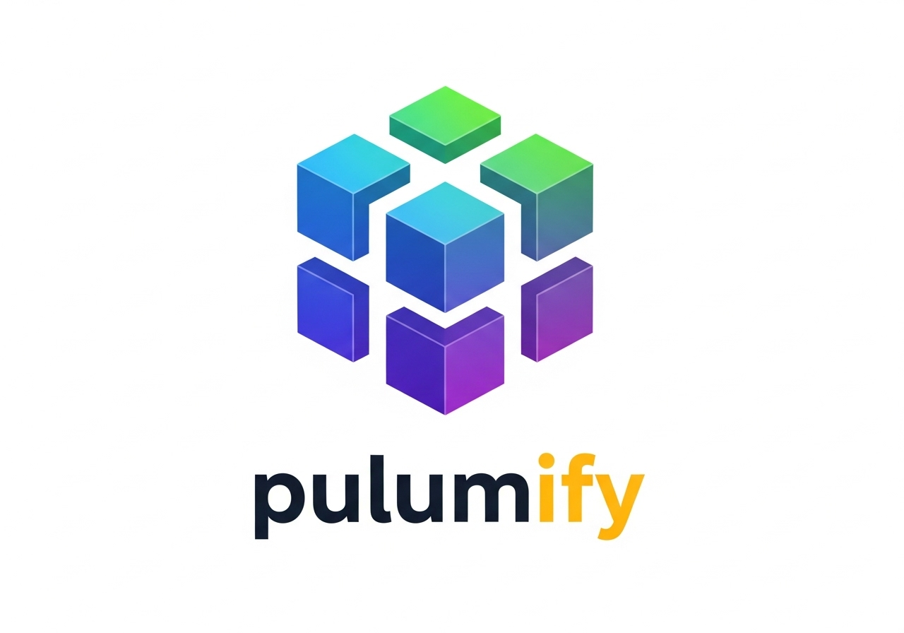

# pulumify
🚀 A CLI tool to scan existing AWS resources and generate a Pulumi import file, kickstarting your journey to Infrastructure as Code.

This tool automates the discovery of your AWS resources to accelerate Pulumi adoption. It provides a polished CLI experience to:

- **Scan** your AWS account for dozens of resource types, including networking, compute, and serverless.
- **Generate** a pulumi_import.json file formatted for Pulumi's bulk import command.
- **Simplify** the migration of manually-created or legacy infrastructure into code.
- **Visualize** discovered resources with a clean summary table.

Stop writing manual import scripts and start managing your cloud with code, faster.

## About
A user-friendly command-line tool designed to bridge the gap between existing AWS infrastructure and Pulumi's Infrastructure as Code. It automatically scans your AWS account, discovers resources like EC2 instances, VPCs, and RDS databases, and generates a ready-to-use import file. This streamlines the otherwise tedious process of bringing brownfield environments under modern IaC management.

## The Problem It Solves

When adopting Pulumi for an environment with pre-existing resources, you need to import them into your Pulumi state. While `pulumi import` is powerful, doing this one-by-one is tedious and error-prone. Manually creating the bulk import JSON file is also a significant effort for large accounts.

This script automates the discovery phase by scanning your AWS account and generating the `pulumi_import.json` file for you.

## How It Works

The workflow is straightforward:

1.  **Run the Script**: The Python script uses the AWS SDK (`boto3`) to scan your account for supported resources.
2.  **Generate JSON**: It creates a `pulumi_import.json` file, which lists every discovered resource with the `type`, `name`, and `id` required by Pulumi.
3.  **Import with Pulumi**: You run `pulumi import --file pulumi_import.json` to import all the resources and generate the corresponding IaC code in your chosen language (e.g., Python, TypeScript).
4.  **Refactor**: You refactor the generated code to create programmatic dependencies, turning hardcoded IDs into dynamic references. This is the key to creating robust IaC.

## Prerequisites

Before you begin, ensure you have the following installed and configured:

1.  **Python 3.8+**
2.  **An AWS Account**
3.  **AWS CLI**: Configured with credentials. The script needs permissions to list and describe resources across various services. The easiest way to ensure this is to use credentials with the `ReadOnlyAccess` managed policy.
    ```bash
    aws configure
    ```
4.  **Pulumi CLI**: [Install the Pulumi CLI](https://www.pulumi.com/docs/install/).

## Usage Instructions

1.  **Clone the Repository**
    ```bash
    git clone <your-repository-url>
    cd <your-repository-directory>
    ```

2.  **Set Up a Virtual Environment (Recommended)**
    ```bash
    python -m venv venv
    source venv/bin/activate  # On Windows, use `venv\Scripts\activate`
    ```

3.  **Install Dependencies**
    ```bash
    pip install -r requirements.txt
    ```

4.  **Run the Discovery Script**
    Execute the script. It will use your default AWS region from your config. You can also specify a region as an argument.
    ```bash
    # Use default region
    python discover_aws_resources.py

    # Or specify a region
    python discover_aws_resources.py us-west-2
    ```
    This will create a `pulumi_import.json` file in the current directory.

5.  **Import into Your Pulumi Project**
    Navigate to your Pulumi project directory, move the generated JSON file there, and run the import command:
    ```bash
    # Make sure you are in your Pulumi project folder
    pulumi import --file pulumi_import.json
    ```
    Pulumi will now import the resources and print the generated code to your console.

## A Crucial Step: Refactoring the Generated Code

The code generated by Pulumi is a literal representation of the imported resources. It's a fantastic starting point, but it's not yet good IaC. You **must** refactor it to build the dependency graph.

**Example: Before Refactoring (Generated Code)**

The generated code will have hardcoded IDs for things like VPCs and Security Groups.

```python
# Code as generated by `pulumi import`
my_instance = aws.ec2.Instance("my-instance",
    subnet_id="subnet-012345abcdef",  # Hardcoded ID
    vpc_security_group_ids=["sg-fedcba987654"], # Hardcoded ID
    ...)

my_sg = aws.ec2.SecurityGroup("my-sg",
    vpc_id="vpc-aabbccddeeff", # Hardcoded ID
    ...)
```

**Example: After Refactoring (Correct IaC)**

Replace the hardcoded strings with programmatic references to the other Pulumi resources.

```python
# Code after manual refactoring
my_vpc = aws.ec2.Vpc("my-vpc", ...) # The imported VPC resource

my_sg = aws.ec2.SecurityGroup("my-sg",
    vpc_id=my_vpc.id,  # Correct programmatic reference!
    ...)

my_instance = aws.ec2.Instance("my-instance",
    subnet_id=my_subnet.id, # Correct reference to a subnet object
    vpc_security_group_ids=[my_sg.id], # Correct reference!
    ...)
```

This refactoring step is what gives Pulumi the power to understand resource relationships, manage updates correctly, and recreate the environment from scratch if needed.

## Supported AWS Services

This script currently discovers the following resources:

*   **EC2 & VPC**: VPCs, Subnets, EC2 Instances, Security Groups, Route Tables, Internet Gateways
*   **IAM**: Roles (excluding AWS service-linked roles)
*   **S3**: Buckets
*   **RDS**: DB Instances
*   **ELBv2**: Load Balancers (ALB/NLB) and Target Groups
*   **Glue**: Crawlers and Jobs

## Contributing

Contributions are welcome! If you'd like to add support for more AWS services:

1.  Fork the repository.
2.  Create a new discovery function in `discover_aws_resources.py` for the new service (e.g., `discover_lambda()`).
3.  Add the function to the `discovery_map` in `main()`.
4.  Test and submit a pull request.

## License

This project is licensed under the MIT License. See the `LICENSE` file for details.

[](https://www.python.org/)
[](https://opensource.org/licenses/MIT)
